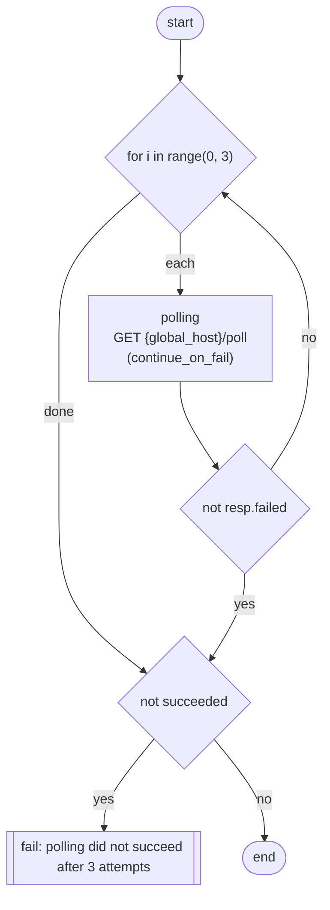

# Scripting Tavern execution with Starlark

Tavern supports advanced test orchestration through Starlark scripting, enabling complex control flow, dynamic test
logic, and multi-stage workflows beyond simple sequential YAML tests.

**This should be considered an experimental work in progress feature and some functionality may change without a major
version bump.**

**This should also only be used when other control flow options are not suitable. Using scripting can make tests harder
to debug, but can be useful for more complex test scenarios.**

## What problem is this trying to solve?

In GitHub actions, stage execution is sequential (like Tavern) but stages can be conditionally executed based on
previous stage results using magic string substitutions, eg:

```yaml
name: basic test

on:
  pull_request:
    branches:
      - main

jobs:
  simple-checks:
    runs-on: ubuntu-24.04

    steps:
      - uses: actions/checkout@v6

      - name: Do something
        id: do-something
        uses: do-something-action@v1

      - name: Do something else
        if: ${{ steps.do-something.outputs.success == 'true' }}
        uses: do-something-else-action@v2
```

Tavern emulates some of this behaviour already, with
the ['skip' key](./core_concepts/marks.md#skipping-stages-with-simpleeval-expressions), and has some limited support for
retries with the ['max_retries' key](./core_concepts/flow.md#retrying-tests). There are other control flow features like
[adding a delay](./core_concepts/flow.md#adding-a-delay-between-tests), each of which have their own specific syntax for
use.

To try and combine all of these into one unified test execution model, we need a way to express complex logic
declaratively, in a format that is more readable than interpolated strings in YAML.

## Starlark Overview

Starlark is a Python-like language designed for configuration and build systems. It provides:

- Python-like syntax familiar to most developers
- Deterministic execution (not turing complete)
- Safe, sandboxed environment
- Built-in control flow: `if/elif/else`, `for`
- Basic types: `str`, `int`, `list`, etc.
- Basic built-in functions: `len()`, `max()`, `min()`, `type()`, `sorted()`

## Enabling Starlark

Starlark control flow is an experimental feature. Enable it with the pytest flag:

```bash
pytest --tavern-experimental-starlark-pipeline
```

## Basic Usage

### Inline Control Flow

Define Starlark scripts directly in your YAML using the `control_flow` key:

```yaml
---
test_name: Test control_flow with inline Starlark - basic sequential

stages:
  - name: Get cookie
    id: get_cookie
    request:
      url: "{global_host}/get_cookie"
      method: POST
      json:
        cookie_name: test-cookie
    response:
      status_code: 200
      cookies:
        - test-cookie

  - name: Echo a value
    id: echo_value
    request:
      url: "{global_host}/echo"
      method: POST
      json:
        value: "hello"
    response:
      status_code: 200
      json:
        value: "hello"

# Inline Starlark script that controls execution order
control_flow: |
  # Load the stage runner helper
  load("@tavern_helpers.star", "run_stage")

  # First run the get_cookie stage. If this fails, it will fail the test.
  resp = run_stage("get_cookie")

  # Then run the echo_value stage
  resp = run_stage("echo_value")
```

This key being present will _override_ the default sequential test execution.

Notes about the execution model:

- All existing Tavern functionality remains the same. Pytest fixtures and marks are applied (including `parametrize`),
  tinctures are run between stages, Tavern hooks are called.
- [`finally` stages](./core_concepts/flow.md#finalising-stages) are _not_ run.
- If `run_stage()` is not called, an exception will be raised. This mirrors Pytest's default behaviour, where it will
  exit with exit code 1 if no tests were run.

### Stage Requirements

Each stage referenced from Starlark must have an `id` key:

```yaml
stages:
  - name: My stage name
    id: my_stage_id    # Required for Starlark reference
    request:
    # ... request config
```

## Available Functions

See [the autogenerated scripting API docs](./scripting-api.md) for a complete list of available functions.

### `run_stage()`

Execute a test stage by its ID:

```starlark
load("@tavern_helpers.star", "run_stage")

# Basic usage
resp = run_stage("stage_id")

# Continue even if stage fails, fall back to login if necessary
resp = run_stage("try_get_user_data", continue_on_fail=True)
if resp.failed:
    log("Login failed")
    run_stage("login")
    run_stage("try_get_user_data")

# Pass variables to the stage
resp = run_stage("verify_data", extra_vars={
    "key": "value",
    "user_id": extracted_id
})
```

**Parameters:**

- `name` (string, required): Stage ID to execute
- `continue_on_fail` (bool, optional): If `True`, return a failed response instead of raising an exception. Default:
  `False`
- `extra_vars` (dict, optional): Additional variables to merge into the stage's configuration

**Return value:** A response struct with properties:

- `.failed` (bool): `True` if the stage failed
- `.success` (bool): `True` if the stage succeeded
- `.request_vars`: Variables captured during request execution
- `.stage_name`: Name of the executed stage

The struct also has properties specific to the response type, currently only available for HTTP responses:

- `.body`: Response body (parsed JSON if `Content-Type` is `application/json`, otherwise raw bytes)
- `.status_code`: HTTP status code
- `.headers`: Response headers
- `.cookies`: Response cookies

### Regex Functions

Pattern matching and extraction via the `re` module:

```starlark
load("@tavern_helpers.star", "run_stage", "re")

# Get data containing text to match
resp = run_stage("get_data")

# re.search returns a struct with: group0, groups, start, end
version_match = re.search("v(\\d+)\\.", resp.body)
if version_match == None:
    fail("Failed to match version pattern")

# Access captured groups
major_version = version_match.groups[0]

# Use extracted values in next stage
resp = run_stage("verify", extra_vars={
    "major_version": major_version
})
```

**Available regex functions:**

- `re.match(pattern, string)`: Match at the beginning of the string
- `re.search(pattern, string)`: Search anywhere in the string
- `re.sub(pattern, replacement, string)`: Substitute pattern matches

**Return value for match/search:** A struct with:

- `.group0`: The full match (group 0)
- `.groups`: List of captured groups
- `.start`: Start position of the match
- `.end`: End position of the match

Returns `None` if no match found.

### `log()`

Log messages to stdout at INFO level:

```starlark
log("Starting pipeline execution")
log("Stage completed with status: " + resp.status_code)
```

### `fail()`

Explicitly fail the test with a message:

```starlark
if resp.failed:
    fail("Stage failed unexpectedly")
```

## Working with Included Stages

Stages defined in included files can be referenced by their IDs:

```yaml
---
test_name: Test control_flow with included stages

includes:
  - !include stages.yaml

# Inline Starlark script using included stage IDs
control_flow: |
  load("@tavern_helpers.star", "run_stage")

  # Run stages defined in stages.yaml
  resp = run_stage("get-cookie-included")
  resp = run_stage("echo-value-included")

  if resp.failed:
    fail("Included stage failed")
```

Stages defined in global configuration are also available:

```yaml
# Run with --tavern-global-cfg /path/to/global_cfg.yaml
---
test_name: Test with global stages

control_flow: |
  load("@tavern_helpers.star", "run_stage")

  # Run a stage defined in global_cfg.yaml
  run_stage("finally-nothing-check")
```

## Programming Patterns

### Extracting and Using Response Data

Use regex to extract values from responses and pass them to subsequent stages:

```yaml
---
test_name: Test regex extraction with inline Starlark

stages:
  - name: Get regex test data
    id: get_regex_data
    request:
      url: "{global_host}/regex_data"
      method: GET
    response:
      status_code: 200

  - name: Verify extracted values
    id: verify_extracted
    request:
      url: "{global_host}/verify_extracted"
      method: POST
      json:
        major_version: "{major_version}"
        token_id: "{token_id}"
        server_name: "{server_name}"
    response:
      status_code: 200
      json:
        status: "verified"

control_flow: |
  load("@tavern_helpers.star", "run_stage", "re")

  # Get data
  resp = run_stage("get_regex_data")
  if resp.failed:
    fail("get_regex_data stage failed")

  # Extract version: v2.5.1 -> capture major version "2"
  version_match = re.search("v(\\d+)\\.", resp.body)
  if version_match == None:
    fail("Failed to match version pattern")
  major_version = version_match.groups[0]

  # Extract token: TKN-a1b2c3d4e5f6 -> capture ID part
  token_match = re.search("\"TKN-(.+)\"", resp.body)
  if token_match == None:
    fail("Failed to match token pattern from " + resp.body)
  token_id = token_match.groups[0]

  # Extract server: Server-PROD-01 -> capture "PROD-01"
  server_match = re.search("Server-(\\w+-\\w+)\\s", resp.body)
  if server_match == None:
    fail("Failed to match server pattern")
  server_name = server_match.groups[0]

  # Pass extracted values via extra_vars
  resp = run_stage("verify_extracted", extra_vars={
    "major_version": major_version,
    "token_id": token_id,
    "server_name": server_name
  })
  if resp.failed:
    fail("verify_extracted stage failed")
```

### Retry and Polling

Implement retry logic with `continue_on_fail`:

```yaml
test_name: test for loop with retry

stages:
  - name: polling
    id: polling
    request:
      url: "{global_host}/poll"
      method: GET
    response:
      status_code: 200
      json:
        status: ready

control_flow: |
  load("@tavern_helpers.star", "run_stage", "time")

  succeeded = False
  for i in range(0, 3):
      resp = run_stage("polling", continue_on_fail=True)
      if not resp.failed:
          succeeded = True
          break
      log("polling attempt " + str(i) + " failed")
      time.sleep(1)

  if not succeeded:
      fail("polling did not succeed after 3 attempts")
```

## Visualising a script ("what would happen")

Because a `control_flow` script replaces the normal sequential execution, the order stages actually run in isn't
visible from the YAML. To see it without running anything, pass `--tavern-what-would-happen`:

```bash
pytest --tavern-what-would-happen tests/
```

Tests are collected as normal, but instead of being run they are skipped and a
[mermaid](https://mermaid.js.org/) flowchart is printed for each test with a `control_flow` block. Tests without a
`control_flow` block are just skipped. No requests are made and no sessions are opened, so this is safe to run against
a test suite pointing at a real environment.

For the retry example above, the output is:

````text
### tests/example.tavern.yaml::test for loop with retry


````

The output is a fenced mermaid block, so it can be pasted straight into a GitHub comment or a markdown document.
To write the diagrams to disk instead of (as well as) reading them in the terminal, pass a directory - one `.mmd` file
is written per test:

```bash
pytest --tavern-what-would-happen --tavern-what-would-happen-dir=./diagrams tests/
```

Both options can also be set in `pytest.ini`/`pyproject.toml` as `tavern-what-would-happen` and
`tavern-what-would-happen-dir`.

### What the shapes mean

| Shape                | Meaning                                                                   |
|----------------------|---------------------------------------------------------------------------|
| `(["start"])`        | Start/end of the script                                                   |
| `["stage name..."]`  | A `run_stage()` call, labelled with the stage name and its method and URL |
| `{"condition"}`      | An `if`/`elif` branch, or the head of a `for`/`while` loop                 |
| `[["fail: ..."]]`    | A `fail()` call - the test stops here                                     |
| `("sleep 1")`        | A `time.sleep()` call                                                     |
| `[/"helper()"/]`     | A call to a function defined in the script, linked to its own subgraph    |

Nodes are highlighted in red if `run_stage()` refers to a stage id that doesn't exist, and in yellow if the stage id is
computed at runtime and so can't be checked. This makes the flag a useful static check on its own, as a typo'd stage id
is otherwise only found when that branch is actually taken.

### Limitations

This is a static analysis of the script - it never runs it - so:

- Every branch is shown, including ones that could never be taken.
- Stage ids that aren't string literals can't be resolved, and are shown as-is.
- `run_stage()` calls inside comprehensions aren't rendered.
- Variables are not interpolated, so URLs are shown as written (`{global_host}/poll`).
- Stages from `--tavern-global-cfg` are only resolved if that flag is also passed.

`--tavern-what-would-happen` does *not* require `--tavern-experimental-starlark-pipeline`, and works without the
`scriptable` extra installed.

## Current Limitations

### HTTP-Only Support

**Important:** Starlark control flow currently only works with HTTP/REST tests. Other protocol backends (MQTT, gRPC,
GraphQL) are not yet supported.

Attempting to use `run_stage()` with non-HTTP stages will raise a `NotImplementedError`.

### Error Messages

Starlark error messages can be unhelpful when debugging failures. Error context may be limited, showing:

- `"Error evaluating starlark script"` without detailed stack traces
- `"Stage with id '<id>' not found"` without listing available stages
- Python exceptions wrapped without full traceback information

**Tips for debugging:**

1. Run with [`--tavern-what-would-happen`](#visualising-a-script-what-would-happen) to see the shape of the script and
   to check every stage id exists
2. Use `log()` statements to trace execution flow
3. Check stage IDs match exactly (case-sensitive)
4. Verify `control_flow` indentation (YAML multi-line strings)
5. Test regex patterns separately before using in scripts

### Type Restrictions

Starlark uses a JSON-serializable subset of Python types. Objects passed between Python and Starlark must be:

- Primitives: `str`, `int`, `float`, `bool`, `None`
- Collections: `dict` (with string keys), `list`, `tuple`
- Dataclasses (automatically converted to dicts)

Non-serializable objects (file handles, database connections, custom classes without `to_starlark()` method) can be
passed through to Starlark, but will be opaque and unusable.

## Starlark Language Reference

For complete language details, see
the [Starlark specification](https://github.com/bazelbuild/starlark/blob/master/spec.md).

Key differences from Python:

| Feature        | Python             | Starlark                                                  |
|----------------|--------------------|-----------------------------------------------------------|
| Classes        | Yes                | No user-defined classes (use `struct` to emulate classes) |
| Exceptions     | `try/except/raise` | No exception handling                                     |
| Comprehensions | Yes                | List + dict comprehensions only                           |
| Lambda         | Yes                | No                                                        |

## Examples

See the integration test files in `tests/integration/starlark/` for complete working examples of basic control flow,
includes, regex extraction, retry patterns

## Possible future improvements

- Add more library functions. Currently only `re` is available, starlark-go
  has [starlib](https://github.com/qri-io/starlib) which exposes a lot of useful functions (math, hashing, base64,
  etc).
- Support MQTT, gRPC, GraphQL. This becomes a bit more complicated with the new custom backend functionality.
- Make error messages more helpful.
- Add more helper functions (ensure JWT is valid, sleeping (time module?), etc).
    - Make this auto-export functions into either this document with mkdocstrings into
    - Let users import their own functions into starlark?
- Add a new CLI/ini flag to say "run 'finally' stages when using starlark script"
